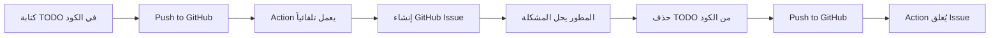

# 🤖 GitHub Action - TODO to Issue (دليل الخبراء)

<div dir="rtl">

## 📌 نظرة عامة

تم إعداد هذا المشروع باستخدام **GitHub Action احترافي** يقوم تلقائياً بتحويل تعليقات TODO في الكود إلى GitHub Issues مُنظمة ومُصنفة.

</div>

---

## 🎯 الميزات المُفعّلة

| الميزة | الوصف | الحالة |
|--------|--------|--------|
| 🤖 **إنشاء تلقائي** | يُنشئ Issues تلقائياً عند إضافة TODO | ✅ مُفعّل |
| 🏷️ **تصنيف ذكي** | يُضيف Labels حسب نوع وأولوية كل TODO | ✅ مُفعّل |
| 👤 **تعيين تلقائي** | يُعين Issue للمطور الذي أضاف TODO | ✅ مُفعّل |
| ✅ **إغلاق تلقائي** | يُغلق Issue عند حذف TODO من الكود | ✅ مُفعّل |
| 📊 **6 أنواع TODO** | TODO, FIXME, HACK, XXX, BUG, NOTE | ✅ مُدعم |
| ⏰ **جدولة** | يعمل كل يوم اثنين + عند Push + يدوياً | ✅ مُفعّل |
| 📝 **قوالب احترافية** | Issues مُنسقة بمعلومات كاملة | ✅ مُفعّل |

---

## 📚 الملفات المُنشأة

### 1. ⚙️ ملفات GitHub Actions

| الملف | الوصف |
|-------|--------|
| `.github/workflows/create-todo-issues.yml` | الـ Workflow الرئيسي لإنشاء Issues |
| `.github/workflows/setup-labels.yml` | إعداد Labels المطلوبة (مرة واحدة) |
| `.github/workflows/todo-dashboard.yml` | تقرير يومي بإحصائيات TODOs |

### 2. 📖 ملفات التوثيق

| الملف | الوصف |
|-------|--------|
| `.github/TODO_WORKFLOW_GUIDE.md` | **الدليل الشامل** - كل شيء عن الـ Action |
| `.github/TODO_QUICK_START.md` | **دليل البداية السريعة** - ابدأ في 5 دقائق |
| `.github/TODO_DASHBOARD.md` | **Dashboard** - يُحدّث تلقائياً بالإحصائيات |
| `examples/todo_best_practices.py` | **أمثلة عملية** - 50+ مثال احترافي |
| `README_TODO_ACTION.md` | هذا الملف - ملخص شامل |

### 3. 🛠️ أدوات مساعدة

| الملف | الوصف |
|-------|--------|
| `scripts/scan_todos.sh` | **سكريبت محلي** - لفحص TODOs قبل Push |
| `.github/TODO_SCAN_RESULT.md` | نتائج آخر فحص محلي |

---

## 🚀 البداية السريعة

### الخطوة 1: إعداد Labels (مرة واحدة فقط)

```bash
# اذهب إلى:
# Actions → Setup Labels for TODO Action → Run workflow
```

أو شغل الأمر يدوياً:
```bash
gh workflow run setup-labels.yml
```

### الخطوة 2: اكتب TODO في الكود

```python
# TODO: Add input validation for email field
def register_user(email: str):
    pass

# FIXME: Race condition when accessing shared state
# BUG: Memory leak in this loop
# HACK: Temporary workaround, refactor later
# XXX: This is critical, review carefully!
# NOTE: Algorithm optimized for Python 3.12+
```

### الخطوة 3: Push إلى GitHub

```bash
git add .
git commit -m "Add TODO comments"
git push origin main
```

### الخطوة 4: شاهد السحر ✨

- اذهب إلى تبويب **Issues**
- ستجد Issues جديدة تم إنشاؤها تلقائياً!
- كل Issue مُصنف ومُرتب حسب الأولوية

---

## 🏷️ أنواع TODO المدعومة

### 1. 📝 TODO (مهام عادية)

```python
# TODO: Implement caching mechanism
# TODO: Add retry logic with exponential backoff
# TODO: [Est: 4 hours] Refactor authentication module
```

**Labels:** `type:enhancement`, `priority:medium`, `todo`

**متى تستخدمه:** لميزات جديدة أو تحسينات مستقبلية

---

### 2. 🔥 FIXME (مشاكل عاجلة)

```python
# FIXME: Race condition in multi-threading
# FIXME: Null pointer exception possible here
# FIXME: API returns 500 under high load
```

**Labels:** `type:bug`, `priority:high`, `needs-fix`, `todo`

**متى تستخدمه:** لمشاكل معروفة تحتاج إصلاح سريع

---

### 3. ⚠️ HACK (حلول مؤقتة)

```python
# HACK: Hardcoded credentials for testing
# HACK: Using eval() - replace with AST parser
# HACK: Bypassing validation for demo
```

**Labels:** `type:technical-debt`, `priority:medium`, `refactor`, `todo`

**متى تستخدمه:** لكود يحتاج إعادة كتابة أو تحسين

---

### 4. ❗ XXX (تحذيرات مهمة)

```python
# XXX: This code is performance-critical
# XXX: Do not modify without consulting team
# XXX: Security-sensitive section
```

**Labels:** `type:attention-needed`, `priority:high`, `todo`

**متى تستخدمه:** لأجزاء حساسة تحتاج انتباه خاص

---

### 5. 🐛 BUG (أخطاء حرجة)

```python
# BUG: Memory leak in this function
# BUG: Crashes when input is empty
# BUG: Database connection not closed
```

**Labels:** `type:bug`, `priority:critical`, `todo`

**متى تستخدمه:** لأخطاء خطيرة تحتاج إصلاح فوري

---

### 6. 📄 NOTE (ملاحظات توثيقية)

```python
# NOTE: This algorithm is O(n²) complexity
# NOTE: Optimized for Python 3.12+ only
# NOTE: See RFC-1234 for specification
```

**Labels:** `type:documentation`, `priority:low`, `todo`

**متى تستخدمه:** لملاحظات توثيقية أو تذكيرات

---

## 🎨 أمثلة احترافية

### مثال 1: TODO مع سياق كامل

```python
# TODO: Implement Redis caching layer
#       Requirements:
#       - Cache TTL: 1 hour (configurable)
#       - Cache key: policy_name + input_hash
#       - Invalidate on policy update
#       Expected impact: 70% faster evaluation
#       Estimated effort: 6 hours
#       Dependencies: Redis client library
def evaluate_policy(policy_name, input_data):
    pass
```

✅ **نتيجة:** Issue مُفصّل بكل المعلومات المطلوبة

---

### مثال 2: FIXME مع خطوات إعادة المشكلة

```python
# FIXME: Race condition in concurrent evaluations
#        Steps to reproduce:
#        1. Run 10 concurrent requests
#        2. Use same policy file
#        3. Observe corrupted state
#        Solution: Add mutex lock or use thread-local storage
#        Priority: HIGH - affects production!
def concurrent_evaluate():
    pass
```

✅ **نتيجة:** Issue واضح يسهل حله

---

### مثال 3: TODO مع ربط Issues أخرى

```python
# TODO: Refactor authentication module (related to #42)
#       Blocked by: #38 (config refactoring)
#       Depends on: #51 (user model update)
#       References: docs/auth-design.md
def authenticate_user():
    pass
```

✅ **نتيجة:** Issue مرتبط بالسياق الكامل

---

## 🔧 الاستخدام المتقدم

### 1. فحص TODOs محلياً قبل Push

```bash
# شغل السكريبت للفحص المحلي
./scripts/scan_todos.sh

# فحص مجلد محدد فقط
./scripts/scan_todos.sh src/

# فحص ملف واحد
./scripts/scan_todos.sh src/main.py
```

**الفوائد:**
- ✅ اكتشف TODOs قبل Push
- ✅ تقرير ملون بالأولويات
- ✅ ملف Markdown بالنتائج
- ✅ تحذير إذا وُجدت BUGs حرجة

---

### 2. تشغيل Action يدوياً

```bash
# من واجهة GitHub
# Actions → Create Issues from TODOs → Run workflow

# أو من سطر الأوامر
gh workflow run create-todo-issues.yml
```

---

### 3. عرض Dashboard الإحصائيات

```bash
# شغل Dashboard workflow
gh workflow run todo-dashboard.yml

# ثم اذهب إلى:
# .github/TODO_DASHBOARD.md
```

**يعرض:**
- 📊 إجمالي TODOs المفتوحة
- 🎯 التوزيع حسب الأولوية
- 📝 التوزيع حسب النوع
- 👥 التوزيع على المطورين
- ⏰ أقدم TODOs تحتاج انتباه

---

## 📊 مراقبة Issues

### 1. عرض كل TODOs المفتوحة

```
is:issue is:open label:todo
```

### 2. عرض حسب الأولوية

```
is:issue is:open label:priority:critical
is:issue is:open label:priority:high
is:issue is:open label:priority:medium
```

### 3. عرض حسب النوع

```
is:issue is:open label:type:bug
is:issue is:open label:type:enhancement
is:issue is:open label:type:technical-debt
```

### 4. عرض TODOs المُعينة لك

```
is:issue is:open label:todo assignee:@me
```

---

## 🎓 أفضل الممارسات

### ✅ DO (افعل)

```python
# ✅ محدد وواضح
# TODO: Add email validation using regex RFC 5322

# ✅ يتضمن تقدير الوقت
# FIXME: [Est: 2 hours] Fix memory leak in loop

# ✅ يربط بالوثائق
# TODO: Implement OAuth2 (see docs/auth.md)

# ✅ يحدد المسؤول
# FIXME: @john-doe review this critical section

# ✅ يضيف سياق الأعمال
# TODO: [Revenue Impact] Add premium features
```

### ❌ DON'T (لا تفعل)

```python
# ❌ غامض جداً
# TODO: fix this

# ❌ بدون نقطتين
# TODO add validation

# ❌ lowercase
# todo: implement feature

# ❌ بدون تفاصيل
# FIXME: broken
```

---

## 🔄 دورة حياة TODO



---

## 📈 إحصائيات المشروع الحالي

نتائج آخر فحص:

| النوع | العدد | الأولوية |
|-------|-------|----------|
| 📝 TODO | 161 | Medium |
| 🔥 FIXME | 53 | High |
| ⚠️ HACK | 27 | Medium |
| ❗ XXX | 15 | High |
| 🐛 BUG | 6 | **Critical** |
| 📄 NOTE | 31 | Low |
| **المجموع** | **293** | - |

⚠️ **تنبيه:** يوجد 6 BUGs حرجة تحتاج إصلاح فوري!

---

## 🛠️ استكشاف الأخطاء

### المشكلة: لا يتم إنشاء Issues

**الحلول:**

1. ✅ تحقق من الصلاحيات:
   ```
   Settings → Actions → Workflow permissions
   → Enable "Read and write permissions"
   ```

2. ✅ تحقق من صيغة TODO:
   ```python
   # ✅ صحيح
   # TODO: description
   
   # ❌ خطأ
   # TODO description  (بدون نقطتين)
   # todo: description (lowercase)
   ```

3. ✅ راجع Logs في تبويب Actions

---

### المشكلة: Issues مكررة

**الحلول:**

1. تجنب triggers متعددة للنفس الكود
2. استخدم `CLOSE_ISSUES: true` لإغلاق المحلولة
3. فعّل `INSERT_ISSUE_URLS` للتتبع الأفضل

---

## 📚 الموارد الإضافية

| المورد | الوصف | الرابط |
|--------|--------|--------|
| 📖 **الدليل الشامل** | كل شيء عن الـ Action | `.github/TODO_WORKFLOW_GUIDE.md` |
| 🚀 **البداية السريعة** | ابدأ في 5 دقائق | `.github/TODO_QUICK_START.md` |
| 💡 **أفضل الممارسات** | 50+ مثال احترافي | `examples/todo_best_practices.py` |
| 📊 **Dashboard** | إحصائيات مباشرة | `.github/TODO_DASHBOARD.md` |
| 🔧 **Action الرسمي** | الوثائق الكاملة | [GitHub](https://github.com/alstr/todo-to-issue-action) |

---

## 🎯 الخطوات التالية

### للبدء الآن:

1. ✅ **اقرأ** هذا الملف (أنت هنا!)
2. ✅ **شغّل** `./scripts/scan_todos.sh` لرؤية TODOs الحالية
3. ✅ **جرّب** كتابة TODO جديد وPush
4. ✅ **شاهد** Issue يُنشأ تلقائياً
5. ✅ **استكشف** `.github/TODO_WORKFLOW_GUIDE.md` للتفاصيل

### للاحتراف:

1. 📚 اقرأ `examples/todo_best_practices.py`
2. 🔧 خصص الـ Action حسب احتياجك
3. 📊 راقب Dashboard يومياً
4. 🎯 طبق best practices في فريقك
5. 🚀 شارك تجربتك مع الآخرين

---

## 💡 نصائح الخبراء

<div dir="rtl">

### 1. التنظيم هو المفتاح
- استخدم أنواع TODO المختلفة حسب الغرض
- أضف أولوية في التعليق نفسه
- اربط TODOs بـ Issues أو PRs ذات صلة

### 2. الوضوح يوفر الوقت
- كن محدداً في الوصف
- أضف خطوات للحل إن أمكن
- وضح التأثير المتوقع

### 3. المتابعة مهمة
- راجع Dashboard أسبوعياً
- أعط أولوية للـ BUGs و FIXMEs
- احذف TODOs المحلولة فوراً

### 4. العمل الجماعي
- عيّن المسؤولين في TODOs
- استخدم mentions لجذب الانتباه
- ناقش الحلول في Issues المُنشأة

</div>

---

## 🎉 الخلاصة

الآن لديك نظام احترافي كامل لإدارة TODOs:

- ✅ **إنشاء تلقائي** للـ Issues
- ✅ **تصنيف ذكي** حسب النوع والأولوية
- ✅ **إغلاق تلقائي** عند الحل
- ✅ **Dashboard** للمتابعة
- ✅ **أدوات محلية** للفحص
- ✅ **توثيق شامل** بالعربية والإنجليزية

**استمتع بالإنتاجية! 🚀**

---

<div dir="rtl">

## 📞 الدعم

لأي استفسارات أو مشاكل:

1. راجع `.github/TODO_WORKFLOW_GUIDE.md`
2. راجع [Action الرسمي](https://github.com/alstr/todo-to-issue-action)
3. افتح Issue في المشروع

</div>

---

**تم الإعداد بواسطة:** GitHub Copilot 🤖  
**التاريخ:** 2 أكتوبر 2025  
**الإصدار:** v1.0  

<div align="center">

### ⭐ إذا أعجبك هذا الإعداد، شاركه مع فريقك!

</div>
